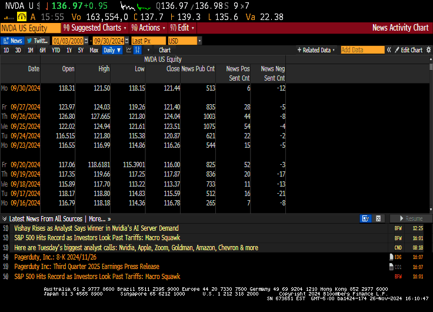

# Predicting Next-Day Stock Closing Prices using Machine Learning and Sentiment Analysis

This project aims to predict the next day's stock closing price using historical stock data and sentiment analysis from financial news and social media. It explores different models, including Auto-ARIMA, SARIMAX, Random Forest, and LSTM, and evaluates the impact of sentiment data on stock price predictions.

### Features
* Stock Data: Nasdaq 100 and S&P 500 indices (from Yahoo Finance and TC 2000).
* Sentiment Data: Extracted from Bloomberg Terminal, including sentiment from financial news and tweets.

* Models: Time series models (Auto-ARIMA, SARIMAX), Random Forest, and LSTM.

* Evaluation Metrics: MAE, MSE, RMSE, R² Score, and MSE for LSTM.

### Results
The models were evaluated using the Nasdaq 100 and S&P 500 indices. Here’s a summary of the results:

SARIMAX: The SARIMAX model with sentiment as an exogenous variable did not improve prediction accuracy. The model's performance showed limited predictive power, particularly in the short-term. Despite incorporating sentiment data, the model only predicted tomorrow's stock price to be the same as today's, indicating no short-term predictive value. Key evaluation metrics for SARIMAX (MAE = $2714.69, RMSE = $2758.00) suggested that the inclusion of sentiment did not enhance its forecasting ability.

Random Forest: This model performed better than SARIMAX, with notable improvements in predictive accuracy. However, when sentiment data was added, performance actually worsened. The Random Forest model showed a solid $R^2$ score of 0.78 for the Nasdaq 100, indicating that it was able to explain a significant portion of the variance in the data. The best evaluation metrics were achieved for the S&P 500 with MAE = $191.18 and RMSE = $331.56.

LSTM: The LSTM model outperformed both SARIMAX and Random Forest, showing the best predictive power. It demonstrated strong performance in capturing sequential dependencies in the data. The model achieved an MSE of $0.005$ for Nasdaq and $0.0007$ for S&P 500, indicating its capability in learning long-term patterns. Despite its effectiveness, adding sentiment data to LSTM did not improve its performance.

Limitations
There are several limitations to this project:

Sentiment Data Limitation: Assuming sentiment data directly influences stock prices oversimplifies the complexities of market behavior. Stock prices are influenced by numerous factors (e.g., economic indicators, market events, geopolitical news) that are not captured by sentiment analysis alone. Additionally, sentiment data was derived only from the top 15 stocks within the indices, which may not represent the broader market sentiment effectively.

Model Performance with Sentiment: Despite using various models (SARIMAX, Random Forest, LSTM), the incorporation of sentiment data did not consistently improve the prediction accuracy. For some models, such as Random Forest, adding sentiment led to a reduction in performance. This suggests that integrating sentiment data requires careful feature engineering and possibly more sophisticated models that can effectively capture non-linear relationships and market dynamics.

Computational Challenges with Random Forest: The Random Forest model, while effective for stock price prediction, is computationally intensive, especially with large datasets. Training time increases significantly with the inclusion of additional features or larger datasets, and hyperparameter tuning can be resource-heavy.

Challenges with LSTM Model Architecture: Finding the right LSTM architecture was challenging. Some configurations resulted in the model learning only the average stock price, which was not useful for capturing meaningful patterns. Moreover, LSTM models require significant tuning and experimentation to achieve optimal results, especially for real-time forecasting.

Limitations of SARIMAX: SARIMAX struggled to capture the non-linear relationships inherent in stock market data, especially when sentiment was included. Despite being a strong model for time series data, its inability to adapt to complex interactions between sentiment and stock prices made it less effective for this task.

Data Accessibility and Quality: The sentiment data from Bloomberg Terminal was pre-processed and lacked weighted sentiment scores, which could have provided more insight into the importance of specific news articles or tweets. Furthermore, the sentiment scores from only 15 stocks did not capture the full market sentiment, leading to potential gaps in analysis.

Future Work
Future work could focus on exploring alternative methods for incorporating sentiment data, such as weighting sentiment scores based on relevance or using more granular data from diverse news sources and social media platforms. It may also be beneficial to experiment with other advanced machine learning techniques, such as attention-based models or reinforcement learning, to capture the dynamic nature of stock market behavior. Additionally, improving the quality and scope of sentiment data, possibly by incorporating more diverse factors and events, could help better capture the true impact of news and social media on stock prices.

License
This project is licensed under the MIT License - see the LICENSE file for details.

